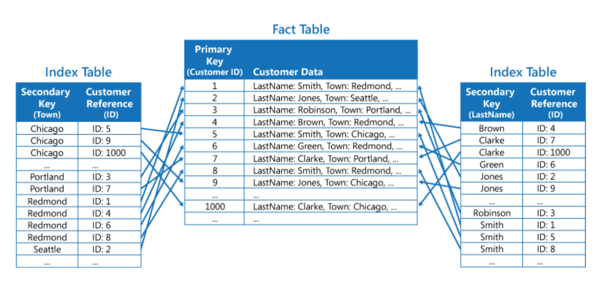

# Clase 04 - Introducción a Mongo

## Framework Aggregate

Permite realizar operaciones de procesamiento de datos avazanda sobres documentos de una colección. Además permite hacer transformaciones complejas, combinación de datos y cálculos utilizando una serie de etapa de agregación. Cada etapa de agregación se aplica en secuencia a los documentos de entrada. O sea toma los resultados de la etapa anterior y generar una nueva salida procesada. 
IMPORTANTE: Ocurre todo dentro del motor de Mongo.

<https://www.mongodb.com/docs/manual/aggregation/>
<https://www.mongodb.com/docs/manual/reference/operator/aggregation/>
<https://www.mongodb.com/developer/products/mongodb/introduction-aggregation-framework/>

* $match: Podemos realizar condiciones para afinar nuestra búsqueda sobre documentos. Muy parecido al find()
* $project: Permite añadir, renombrar, eliminar o relizar operaciones sobre los fields de los documentos. 
* $limit: Permite delimitar la cantidad de documentos
* $group: Permite agrupar documentos con la finalidad de calcular valores basados en una colección.
* $sort: Podemos ordenar nuestros documentos basado en uno o varios fields.
* $skip: Permite saltar los documentos indicados
* $count: Permite obtener el número de documentos que tienen en la etapa especifica
* $out: Permite agregar los documentos obtenidos en una nueva colección.
* $unwind: Desarma el array y genera multiples documentos, creando una copia del documento original por cada elemento del lista (array)
* $regex: Permite usar expresiones regulares para buscar patrones en strings (like)
* $reduce: Aplicar una expresión a cada elemento de un array y acumula el resultado.
* $avg, $max, $min, $sum: Funciones de agregación para sacar el promedio, el valor máximo, el valor mínima y la sumatoria de elementos.
* $lookup: Realiza una unión entre colecciones. Es similar a una unión externa izquierda ( LEFT OUTER JOIN ). Toma documentos de una colección (de entrada) y los enriquece con los datos relaciones de otra colecciones (colección unida)

## Creando set de datos para trabajar con el framework aggregate

```js
db.facturas.insertMany(
    [
        {
            nombre: 'Monitor', total: 233.30, cliente: 'Camila'
        },
        {
            nombre: 'Guitarra', total: 433.30, cliente: 'Evelyn'
        },
        {
            nombre: 'Guitarra', total: 564.30, cliente: 'Alfredo'
        },
        {
            nombre: 'Cafetera', total: 864.2, cliente: 'Jose'
        },
        {
            nombre: 'Silla', total: 478.8, cliente: 'Marcos'
        },
        {
            nombre: 'Televisor', total: 485.8, cliente: 'Tomas'
        },
        {
            nombre: 'Celular', total: 567.4, cliente: 'Maximiliano'
        },
        {
            nombre: 'Monitor', total: 879.2, cliente: 'Juan'
        },
        {
            nombre: 'Celular', total: 878.0, cliente: 'Roberto'
        },
        {
            nombre: 'Zapatos', total: 111.4, cliente: 'Maximiliano'
        },
        {
            nombre: 'Silla', total: 50.8, cliente: 'Tomas'
        },
    ]
)
```

## Laboratorio usando Framework Aggregate

> Averiguar cuanto dinero gasto cada cliente

```js
db.facturas.find({})
db.facturas.aggregate(
    [ /* [] ---> Pipeline */
        { /* Stage 1 */
            $match: {}
        },
        { /* Stage 2 */
            $count: 'totalFacturas'
        }
    ]
)
// ---
db.facturas.aggregate(
    [ /* [] ---> Pipeline */
        { /* Stage 1 */
            $match: {}
        },
        { /* stage 2 */
            $group: {
                _id: '$cliente',
                total: {
                    $sum: '$total'
                }
            }
        },
        { /* stage 3 */
            $sort: { total: -1 }
        }
    ]
)
```

> Cuanto dinero representaron los productos (Guitarra, Monitor, Celular)
> Ordenar el resultado en forma descendente

```js
db.facturas.aggregate(
    [
        { /* stage 1 */
            $match: {
                nombre: {
                    $in: ['Guitarra', 'Monitor', 'Celular']
                }
            }
        },
        /*   { 
            $count: 'Cantidad'
        } */
        { /* stage 2 */
            $group: {
                _id: '$nombre',
                total: { $sum: '$total' },
                valorMax: { $max: '$total' }
            }
        },
        { /* stage 3 */
            $sort: { total: -1 }
        },
        { /* stage 4 */
            $project: {
                valorMax: 1,
                totalRedondeado: { $round: ['$total', 2] }
            }
        }
    ]
)
```

# Practicas con el framework Aggregate

> 1. Facturas superiores a $500
> 2. Contar cuantas facturas existen. "cantidadFacturas"
> 3. Obtener la factura más cara
> 4. Cantidad de facturas por cliente
Maximiliano -> 2
Evelyn -> 1
Tomas -> 2
> 5. Promedio gastado por cliente

## Resolución

//Judith
> 1. Facturas superiores a $500
```js
db.facturas.aggregate([
    {
        $match: {
            total: {
                $gte: 500
            }
        }
    }
])
```

> 2. Contar cuantas facturas existen. "cantidadFactura"
```js
db.facturas.aggregate([
    {
        $count: 'cantidadFactura'
    }
])
```

> 3. Obtener la factura más cara

```js
// Muestro solo el primero
db.facturas.aggregate([
    {
        $sort: { //Ordeno de mayor a menor
            total: -1
        }
    },
    { // Tomo solo el primero
        $limit: 1
    }
])
```
> 4. Total de facturas por cliente
Maximiliano -> 2
Evelyn -> 1
Tomas -> 2
```js
db.facturas.aggregate([
    {
        $group: { /*Agrupo los documentos*/
            _id: '$cliente', /*Defino como agrupar a los clientes*/
            total: {
                $sum: '$total' /*SUmo el importe de la/s factura/s de ese cliente*/
            },
            cantidadFactura: { /*Cuento cuantas facturas tiene ese cliente*/
                $sum: 1
            }
        }
    },
    { /*Ordeno*/
        $sort: {
            total: -1,
        }
    }
])
```
> 5. Profe es el cumple de Elias Quintana, le quería dejar este extra
```js
db.facturas.aggregate([
    {
        $limit: 1
    },
    {
        $project: {
            _id: 0,
            mensaje: {
                $literal: '🎂 ¡FELIZ CUMPLEAÑOS ELIAS! CUMPLEAÑOS FELIZ, QUE LO CUMPLAS FELIZ🎉'
            }
        }
    }
])
```


> Arnold

1-
```js
db.facturas.aggregate([{$match:{total:{$gt: 500}}}])
``` 
```js
2-
db.facturas.aggregate(
    [
        {
            $match:{total:{$gt: 500}}
        },
        {
            $count: 'totalFacturas'
        }
    ]
)
``` 
```js
3-
db.facturas.aggregate(
    [
        {
            $match:{}
        },
        {
            $group:
                {
                    _id:'$nombre',
                    valorMax:{
                        $max:'$total'
                    }
                }
        },
        {
            $sort:{
                valorMax:-1
            }
        },
        {$limit:1}
    
])
``` 

```js
// 4-
db.facturas.aggregate(
    [
        {
            $match:{}
        },
        {
            $group:{
                _id:'$cliente',
                cantidadFactura:{
                    $sum:1
                }
            }
        },
        {
            $sort: {
                 cantidadFactura: -1 
            }
        }
    ]
)
``` 
```js
// 5-
db.facturas.aggregate(
    [
        {
            $match:{}
        },
        {
            $group: {
                _id:'$cliente',
                cantidadFacturas:{$sum:1},
                promedioGastado:{$avg:"$total"}
            }
        }
    ]
)
``` 

> Maxi

```js
// 1
db.facturas.aggregate(
    [ /* [] ---> Pipeline */
        {
            $group: {
                _id: '$cliente',
                total: {$sum: '$total'},
            }
        },
        { /* Stage 1 */
            $match: {total: {$gte: 500}}
        }
    ]
)
// 2  Contar facturas
db.facturas.aggregate(
    [ /* [] ---> Pipeline */
        {
            $count: 'totalFacturas'
        }
    ]
)
// 3 Obtener la factura más cara
db.facturas.aggregate(
    [ /* [] ---> Pipeline */
        {
            $group: {
                _id: '$cliente',
                cantidadFacturas: { $sum: 1 },
                total: {$sum: '$total'},
            }
        },
        {
            $sort: {total: -1}
        },
        {
            $limit: 1
        }
    ]
)

// 4 Cantidad de facturas
db.facturas.aggregate(
    [ /* [] ---> Pipeline */
        {
            $group: {
                _id: '$cliente',
                cantidadFacturas: { $sum: 1 },
                total: {$sum: '$total'},
            }
        }
    ]
)
// 5 Promedio
db.facturas.aggregate(
    [ /* [] ---> Pipeline */
        {
            $group: {
                _id: '$cliente',
                cantidadFacturas: { $sum: 1 },
                total: {$sum: '$total'},
                promedio: {$avg: '$total'}
            }
        }
    ]
)
```

## Unión Productos con Categoría y Marcas

```js
db.products.aggregate(
    [
        {
            $lookup: {
                from: 'categories',
                localField: 'categoryId',
                foreignField: '_id',
                as: 'categoria'
            }
        },
        {
            $unwind: '$categoria'
        },
        {
            $lookup: {
                from: 'brands',
                localField: 'brandId',
                foreignField: '_id',
                as: 'marca'
            }
        },
        {
            $unwind: '$marca'
        }, 
        {
            $project: {
                _id: 1,
                name: 1,
                sku: 1,
                price: 1,
                stock: 1,
                categoria: {
                    _id: "$categoria._id",
                    nombre: '$categoria.name',
                    descripcion: '$categoria.description'
                },
                marca: {
                    _id: '$marca._id',
                    nombre: '$marca.name',
                    pais: '$marca.country'
                }
            }
        },
        {
            $out: 'productos_con_marca_categoria'
        }
    ]
)
```  

# Índices (indexes)

Son estructuras que permiten acceder y buscar los datos de manera eficiente y muy rápida. Esto es igual para todas las bases de datos.



<https://www.mongodb.com/docs/manual/indexes/>

## Índice simple
Se crea a partir de un único field

<https://www.mongodb.com/docs/manual/core/indexes/index-types/index-single/#std-label-indexes-single-field>

```js
db.indices.find({ nombre: 'nombre_444444'})
```

## Índice compuesto
Se crea a partir de una combinación de fields. Optimiza consultas que involucran varios campos a la vez. El orden de los fields importa.


```js
print('Creando 1.000.000 documentos');

for (let i = 0; i < 1_000_000; i++) {
    if ( i % 10_000 === 0) print('--> ' + i + ' documentos insertados');

    db.indices.insertOne(
        {
            nombre: 'nombre_' + i,
            edad: i % 100,
            fecha: new Date()
        }
    )
} 
```

```js
db.indices.find({ nombre: 'nombre_555555' }) // Sin indice -> tarda
db.indices.find({ _id: ObjectId('6aabfd9864ccd17a65b43b42')}) // Con indice -> Es instantaneo
```  